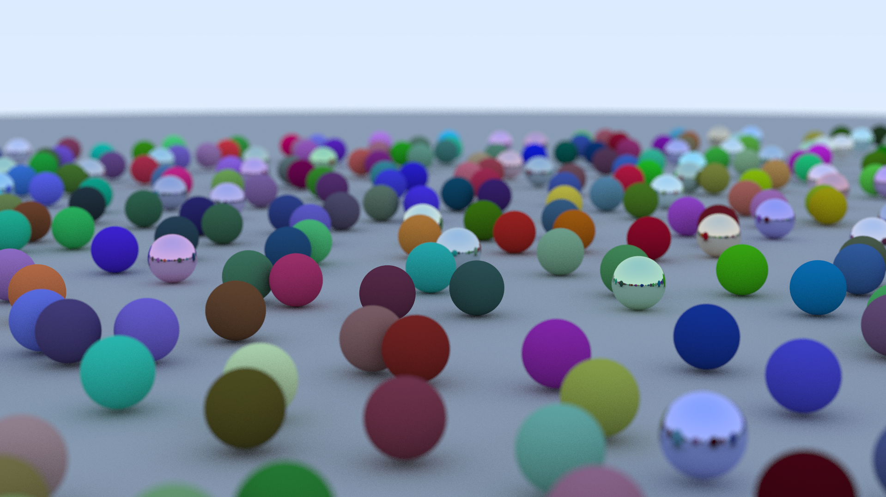
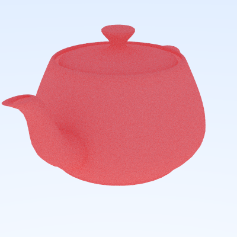

# Bounce

A multithreaded raytracer written in Rust.

## Features

Currently, Bounce supports:

- Rendering spheres
- Camera with adjustable position, direction, depth of field, and field of view
- Diffuse (Lambertian), glass (Schlick), and metallic material
- Multithreaded rendering using [rayon](https://crates.io/crates/rayon)
- OBJ file loading and rendering
- Efficient ray-intersection queries using bounding volume hierarchies
  - Converts the $O(N)$ queries into $O(\log N)$, improving speeds by over 1000x for highly complex scenes (over 1M triangles).

## Planned features

In the future, I plan to add:

- Textures
- Additional object types beyond spheres
- Lights
- Interactive 3D scene builder

### References

[Ray Tracing in One Weekend](https://raytracing.github.io/books/RayTracingInOneWeekend.html)

[Physically Based Rendering: From Theory to Implementation](https://pbr-book.org/)
